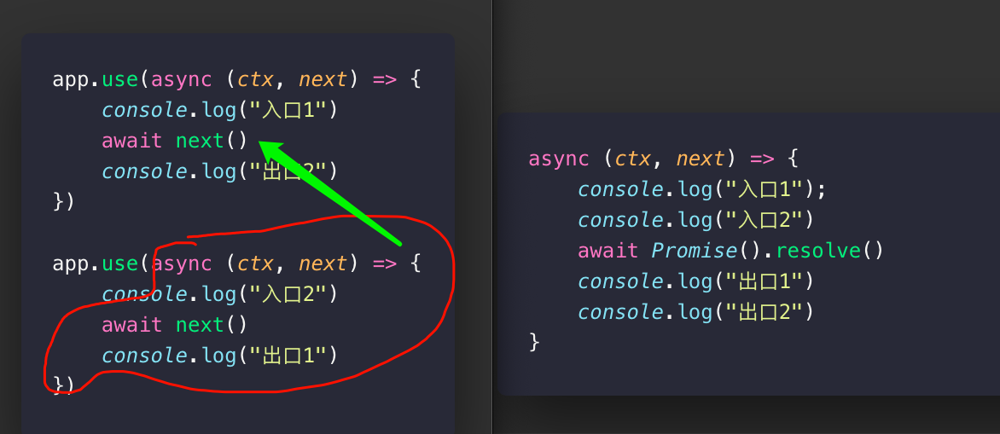

## 尝试实现一个简易Koa

::: tip
Koa 一个比Express更轻量的基于 Nodejs 编写的Web服务器
:::

### 结构分析
当然，今天不是讨论`Koa`是什么或者怎么用，默认再座的各位看官，都是熟练操作`Koa`进行开发，即使不会 `koa` 会 `Express`也是一样的原理，看懂的看个门道，看不懂得看个热闹。作者也是看过很多文章总结下来的，如有瑕疵，请多见谅。

看过`Koa`源码的都知道，内容不多，一共就四个文件夹。`application`,`context`,`response`,`request`,分别对应的是`Koa`实例，上下文，服务端响应，客户端响应，了解了他的结构，再结合日常的使用方法，复原功能变得清晰明了。

### 构建项目
```javascript
mkdir myKoa
cd myKoa
npm init -y 
mkdir lib
cd lib

touch application.js
...
```

### 基本用法
以上操作一气呵成，回顾一下Koa的基本用法
```javascript
const myKoa = require('./lib/application')
const app = new myKoa();

app.use(async (ctx, next) => {
    await ...
})

app.listen(() => {
    console.log('🔥 is successFully')
})
```

### Koa雏形

::: tip
今天的范畴全在`application`,毕竟所有的方法都是基于它扩展。
:::

首先确定的是Koa是一个类实例化，并且目前看来是带有`use`,`listen`方法的实例，并且可能会有多个`middleware`，这样锊下，结构就清晰明了了
,接下来会使用ES6的类方法，不熟悉ES6语法的可以去阅读一下阮一峰老师的ES6。这个类会调用`Node`原生模块的`http`来监听端口,当然少不了事件模块`events`，雏形如下。
```javascript
const EventEmit = require('events')
const http = require('http')

class myKoa extends EventEmit{
    constructor(){
        super()
        this.middleware = [] // 存储所有的中间件
    } 

    use(middleware){
        this.middleware.push(middleware)
    }

    listen(...args){
        const server = http.createServer(this.callback)
        server.listen(...args)
    }

    callback(){ // 接受传入的所有方法（中间件，参数）并执行
        return (req,res)=>{
            console.log('客户端',req)
            console.log('服务端端',res)
        }
    }
}
```

乞丐版就这么搞定了，当然此时啥也做不了，譬如`middleware`并没有实现它的作用，接下来需要拆解他的所有中间件并且递归合并，并且，基于洋葱模型的
的执行机制，会把下一次中间件的内容丢带上一次中间件之间来执行,说人话就是将第二次的`async`方法丢到第一次的`await next()`中间件执行,这样才符合`Koa`的洋葱机制。
```javascript
    compose(){
        function createNext(middleware,oldNext){
            return async () => {
                await middleware(ctx,oldNext) 
                // 这就是传入的async中间函数 等价于
                //await (async(ctx,next)=>{
                //    console.log("入口2")
                //    await next()
                //    console.log("出口1")
                //})
            }
        }
        let len = this.middleware.length;
        let next = Promise.resolve(); //确保每一个next都是异步可执行

        for(let i = len - 1; 1 => 0; i--){ //从尾部取出每一个
            let currentNextMiddleware = this.middleware[i]；
            next = createNext(currentNextMiddleware,next) //尾部依次赋值给当前
        }
        await next()
    }
    
    ...
```
### compose核心步骤
- 从中间件数组末尾开始迭代
- 取出最后一项
- 赋值操作 将第一步的`next`的`Promise`接入到第二部的赋值`let next = Promise.resolve();`,`next = createNext(currentNextMiddleware,next)`
- 执行置换 (如下图)
- 执行结果 返回`createNext`的异步函数
最后再将整个`compose`函数返回,并且执行整个`callback`
```javascript
    ...

    compose(){
        return async (ctx) =>{
            ...
        }
    }
    
    ...

    callback(){
        const ctx = {}
        let fn = this.compose()
        return fn(ctx).then(()=>{
            res.end('🔥')
        })
    }
```
### 洋葱模型核心思路

以上便是个人学习的拙见