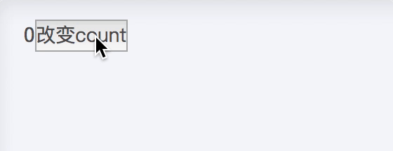
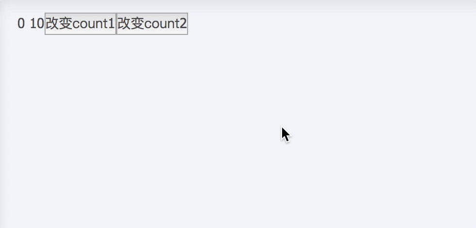
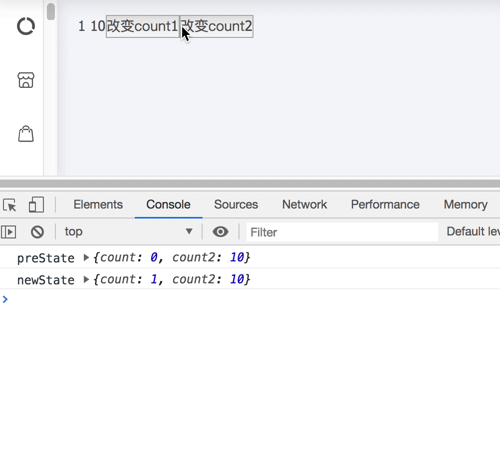
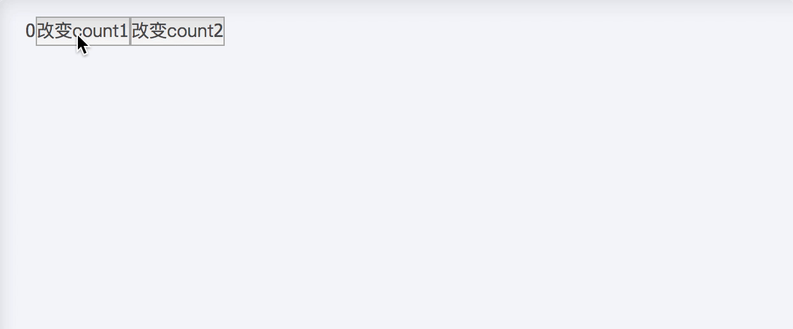

# Hooks


>`React` v16.7.0-alpha 中第一次引入了 Hooks 的概念，在 v16.8.0 版本被正式发布。`React hook` 在 `React` 中只是对 `React hook` 的概念性的描述，在开发中我们用到的实际功能都应该叫做 `React hook`。


## 前言 
`React hook` 一经发行，收到广大程序员的拥戴。得益于 `React hook` 的函数式编程，写法相对于老式的类组件编程产出的代码量少了量的变化，但也并不是绝对的完美，老项目的代码量可不是一朝一夕能被清理掉的，况且还得兼容以前所有的逻辑。所以，迭代咱不考虑，但尝鲜也是足够的。这并不影响大家拥抱新技术。

## 初识Hooks
框架都素以钩子函数，来操作整个流程周期，`Hooks`就是整合聚合函数，减少代码量。现在来了解一下官方提供的钩子函数，基本钩子函数最为常见，其他的钩子函数视情况而使用。
- 基本钩子函数
  - useState
  - useEffect
  - useContext
- 其他钩子函数
  - useCallback
  - useReducer
  - useMemo
  - useRef
  - useLayoutEffect
  - useImperativeHandle
  - useDebugValue

### 基本操作
### useState
此方法创建一个新的状态，接收一个固定的参数值，返回一个新的参数值，返回值由一个数组包装，包括返回新的状态值，以及修改状态值的方法，可以使用数组解构将其结构出来。最新版的 `React` 可以使用 `Fragment` 来包裹，避免使用多余的标签。
```javascript
import React, {useState} from  'react'
const App = () => {
    const [count, setCount] = useState()
    return(<>
        {count}
        <button onClick={() => setCount(Math.ceil(Math.random() * 1000))}>改变count</button>
    </>)
}
``` 
使用方法简单粗暴，简单介绍一下，`useState` 第一个参数为初始值，第二个参数为操作初始值的方法，不传入的话默认为一个空数组，由其解构出来，如果有初始值，可以直接将其注入到 `useState("初始值")` 中，将事件直接绑定到元素之上，也是比较恶心的一件事，但函数式有没有生命周期来执行事件，岂不是很尴尬，接下来的一个钩子函数就能解决这个问题，自带生命周期。



### useEffect
语义化函数，副作用。传统开发中函数式组件，充当展示组件，不想类组件拥有自己的生命周期这一说法，既然要用函数式开发，又不能没有生命周期，`useEffect` 就是来充当这一角色。可以结合 `useState` 来完成整个页面从初始化到数据改变的过程。
```javascript
import React , {useState, useEffect} from 'react'
const App = () => {
    const [count , setCount] = useState(0);
    useEffect(() => {
        setCount(Math.ceil(Math.random() * 1000))
    }, [count]);
    return(<>
        {count}
        <button>改变count<button>
    </>)
}
```
这样看起来就很舒服，但这仅仅只是在当前页面整个的改变数据，毫无周期可言，这也只是基本操作，`useEffect` 第一个参数是一个函数，用来操作事件，第二个参数是调用方法的前提，只要发生改变，变回触发事件，也是通过闭包来实现局部变量保存。这些会在之后的文章提到。接下来，模拟一下生命周期。
```javascript
useEffect(() => {
        setCount(Math.ceil(Math.random() * 1000)),
        return () => {
            setCount(0),
        }
    }, [count]);
```
简单的一句代码，就囊括了类方法中的 `componentDidMount`, `componentWillUnmout` 两个生命周期，这两个是在页面挂载/卸载阶段执行的方法，`useEffect` 第一个参数会在挂载时执行，如果返回第二个参数（方法）就会在当前组件卸载时执行返回的方法，即解决副作用问题。

### useCallback
顾名思义，回调函数。用于将相同逻辑的方法封装到同一个回调中，减少不必要的代码量，配合 `useEffect` 可谓是双宿双飞。
```javascript
import React , {useState, useEffect, useCallback} from 'react'
import { message } from 'antd'
const App = () => {
    const [count , setCount] = useState(0);
    const [count1 , setCount1] = useState(0);
    const calculateCount = useCallback(() => {
    if (count1 && count2) {
        return count * count1;
    }
    return count + count1;
    }, [count, count1])

    useEffect(() => {
        const result = calculateCount(count, count1);
         message.info(`执行副作用，最新值为${result}`);
    }, [calculateCount])
    return(<>
        {count}
        <button>改变count<button>
        <button>改变count1<button>
    </>)
}
```
可以看出， `useCallback` 与 `useEffect` 的用法有异曲同工之妙，几乎可以说是一毛一样，两个相同逻辑的方法，封装到一个 `callback` 回调中，某一个值发生改变即可触发执行事件。



### useRef
`useRef` 有点类似于 类组件中的 `createRef` 接收一个初始值，返回一个对象通过current获取到当前对象，并保存节点当前状态,且保存的变量不会随着数据的变化而重新生成，保持最后一次赋值状态。其功能配合上 `useCabllback`, `useEffect`,完美实现 `preProps/preState` 的功能。
```javascript
const [count, changeCount] = useState(0);
const [count1, changeCount1] = useState(0);
// 创建初始值为空对象的prestate
const preState = useRef({});
// 依赖preState进行判断时可以先判断，最后保存最新的state数据
useEffect(() => {
  const { ... } = preState.current;
  if (// 条件判断) {
    // 逻辑
  }
  // 保存最新的state
  preState.current = {
    count,
    count1,
  }
});
```


### useMemo
Memo 为 Memory 简写，`useMemo` 即使用记忆的内容。主要用于优化性能这块。就像前面所说 `useEffect` 没有设置第二个参数关联状态，每次都会触发。同样通过计算出来的值或者组件状态也都会重新计算/挂载，即使状态并没有发生改变。
在日常业务中， `useMemo` 可以用来缓存计算的值或组件，避免重复计算或者挂载带来不必要的性能浪费。
```javascript
import React, { useState, useMemo } from 'react';
import { message } from 'antd';

export default function HookDemo() {
  const [count1, changeCount1] = useState(0);
  const [count2, changeCount2] = useState(10);

  const calculateCount = useMemo(() => {
    message.info('重新生成计算结果');
    return count1 * 10;
  }, [count1]);
  return (
    <div>
      {calculateCount}
      <button onClick={() => { changeCount1(count1 + 1); }}>改变count1</button>
      <button onClick={() => { changeCount2(count2 + 1); }}>改变count2</button>
    </div>
  );
}
```
参数与 `useEffect` 等钩子函数无差别



初次了解可能只会觉得 `useMemo` 用来做计算缓存，返回值无非是数字类型或者字符串类型。其实，并不关心返回值类型，`useMemo` 内部只接受状态值，依据状态值返回另一个状态。简称 `雨我无瓜`。今天就先讲到这，下节再继续。


## 实操Hooks

> 关于 `React hook` 已经有了基本的了解，进入到实战阶段

### 回顾Hooks特性
`hooks` 称得上是函数式组件吃饭的家伙了，凭借钩子函数来模仿生命周期的流程。靠其简洁的代码量配上高效的性能，可谓是一枝独秀。瞬间占领了类组件的大批江山，受到了广大开发者的青睐。
既然，已经学会了怎么用这些钩子，那就得用一些高级用法，不然会显得很low，真可谓头可断，发型不能乱。

### 编写自己的Hooks组件 <Badge text="基本类型hooks" />
最基本的钩子也就是返回包含了更多逻辑的 State 以及改变 State 方法的钩子。拿定时器来说，其最基本的就是返回当前的数字自减等功能，明确完功能后可以开始动手做了。
```javascript
import React, { useState, useEffect } from 'react';
const App = () => {
    const useTimer = () => {
        const [running, setRunning] = useState(false);
        const [time, setTime] = useState(60);

        useEffect(() => {
            let interval;
            if (running) {
                interval = setInterval(() => {
                    setTime(prev => prev - 1);
                }, 1000);
            }
            return () => {
                clearInterval(interval);
            };
        }, [running]);

        return {
            // 声明开始计数器方法
            start: () => {
                setRunning(true);
            },
            // 声明停止计数器方法
            stop: () => {
                setRunning(false);
            },
            // 声明重置计数器方法
            reset: () => {
                setTime(60);
            },
            time,
            running,
        };
    };
    // 使用方法
    const { start, stop, reset, time, running } = useTimer();
    <>{!running ? '获取验证码' : time + 's后重发'}</>
    useEffect(() => {
        setTimeout(()=>{ start() },1000)
    })
    useEffect(() => {
        if (time === 0) {
        stop();
        reset();
        }
    }, [time]);
}
```
大功告成；解释一下，先定义属于自己的 `hooks` 函数 `useTimer` 用来计算倒计时，给他默认两属性用来记录开始倒计时、倒计时间，用 `useEffect` 来运行倒计时减少，当然条件是倒计时 `running` 正在运行 ，记得清除倒计时
的副作用在 `useEffect` 第二个参数，对外暴露，开始 `start`, 结束 `stop`, 重置 `reset` 的方法，用来控制倒计时。用法也极为简单。效果如下，算得上是入门级别的demo


### 编写自己的Hooks组件 <Badge text="基本类型hooks" />
当然仅仅倒计时并不能满足我们的好奇心，接下来干一个稍微复杂一点的，其实也不能算是复杂，只是将增加、减少、重置结合起来，功能虽增多，却也只是换汤不换药
```javascript
import React, { useState } from 'react';

const  useCounter = (initialValue) => {
  // 接受初始化的值生成state
  const [count, changeCount] = useState(initialValue);
  // 声明减少的方法
  const decrease = () => {
    changeCount(count - 1);
  }
  // 声明增加的方法
  const increase = () => {
    changeCount(count + 1);
  }
  // 声明重置计数器方法
  const resetCounter = () => {
    changeCount(0);
  }
  return [count, { decrease, increase, resetCounter }]
}

export const myHooksView  = () =>{
  // 在函数组件中使用我们自己编写的hook生成一个计数器，并拿到所有操作方法的对象
  const [count, controlCount] = useCounter(10);
  return (
  	<div>
    	当前数量：{count}
			<button onClick={controlCount.decrease}>减少</button>
			<button onClick={controlCount.increase}>增加</button>
			<button onClick={controlCount.resetCounter}>重置</button>
    </div>
  )
}
```
用法类似，就不做过多介绍。


### 编写自己的Hooks组件 <Badge text="DOM类型hooks" />
翻完逻辑数值类型的 `hooks` 自定义组件这座山，就见到大海了？ 答案是 `NO` ,可不止是这点功能呢，还能自定义返回DOM节点的钩子函数，没想到吧。借用一下 `antd` 的库来操作以 Modal举例
```javascript
import React, { useState } from 'react';
import { Modal } from 'antd';

const useModal = () => {
  const [visible, changeVisible] = useState(false);

  const toggleModalVisible = () => {
    changeVisible(!visible);
  };

  return [(
    <Modal
      visible={visible}
      onOk={toggleModalVisible}
      onCancel={toggleModalVisible}
    >
      弹窗内容
  	</Modal>
  ), toggleModalVisible];
}

export const HookDemo = () => {
  const [modal, toggleModal] = useModal();
  return (
    <div>
      {modal}
      <button onClick={toggleModal}>打开弹窗</button>
    </div>
  );
}
```
写法、用法其实和之前的没啥区别，无非就是将值得改变映射到DOM节点上，然后整体返回，符合函数式编程，组件化思路。


## 手搓Hooks
<Badge text="待更新......" />

### 参考
[实操hooks, 看完这篇，你也能把 React Hooks 玩出花](https://juejin.im/post/5d754dbde51d4561cd2466bf)