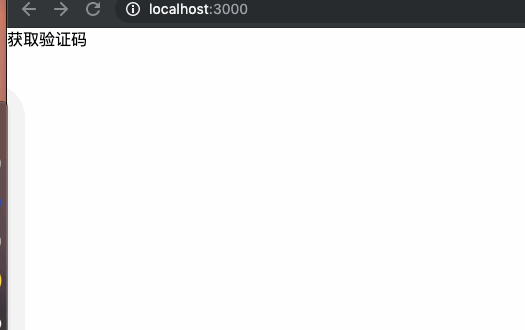

# 实操React新特性Hooks

> 关于 `React hook` 已经有了基本的了解，进入到实战阶段

## 回顾Hooks特性
`hooks` 称得上是函数式组件吃饭的家伙了，凭借钩子函数来模仿生命周期的流程。靠其简洁的代码量配上高效的性能，可谓是一枝独秀。瞬间占领了类组件的大批江山，受到了广大开发者的青睐。
既然，已经学会了怎么用这些钩子，那就得用一些高级用法，不然会显得很low，真可谓头可断，发型不能乱。

## 编写自己的Hooks组件

### 基本类型hooks1
最基本的钩子也就是返回包含了更多逻辑的 State 以及改变 State 方法的钩子。拿定时器来说，其最基本的就是返回当前的数字自减等功能，明确完功能后可以开始动手做了。
```javascript
import React, { useState, useEffect } from 'react';
const App = () => {
    const useTimer = () => {
        const [running, setRunning] = useState(false);
        const [time, setTime] = useState(60);

        useEffect(() => {
            let interval;
            if (running) {
                interval = setInterval(() => {
                    setTime(prev => prev - 1);
                }, 1000);
            }
            return () => {
                clearInterval(interval);
            };
        }, [running]);

        return {
            // 声明开始计数器方法
            start: () => {
                setRunning(true);
            },
            // 声明停止计数器方法
            stop: () => {
                setRunning(false);
            },
            // 声明重置计数器方法
            reset: () => {
                setTime(60);
            },
            time,
            running,
        };
    };
    // 使用方法
    const { start, stop, reset, time, running } = useTimer();
    <>{!running ? '获取验证码' : time + 's后重发'}</>
    useEffect(() => {
        setTimeout(()=>{ start() },1000)
    })
    useEffect(() => {
        if (time === 0) {
        stop();
        reset();
        }
    }, [time]);
}
```
大功告成；解释一下，先定义属于自己的 `hooks` 函数 `useTimer` 用来计算倒计时，给他默认两属性用来记录开始倒计时、倒计时间，用 `useEffect` 来运行倒计时减少，当然条件是倒计时 `running` 正在运行 ，记得清除倒计时
的副作用在 `useEffect` 第二个参数，对外暴露，开始 `start`, 结束 `stop`, 重置 `reset` 的方法，用来控制倒计时。用法也极为简单。效果如下，算得上是入门级别的demo



### 基本类型hooks2
当然仅仅倒计时并不能满足我们的好奇心，接下来干一个稍微复杂一点的，其实也不能算是复杂，只是将增加、减少、重置结合起来，功能虽增多，却也只是换汤不换药
```javascript
import React, { useState } from 'react';

const  useCounter = (initialValue) => {
  // 接受初始化的值生成state
  const [count, changeCount] = useState(initialValue);
  // 声明减少的方法
  const decrease = () => {
    changeCount(count - 1);
  }
  // 声明增加的方法
  const increase = () => {
    changeCount(count + 1);
  }
  // 声明重置计数器方法
  const resetCounter = () => {
    changeCount(0);
  }
  return [count, { decrease, increase, resetCounter }]
}

export const myHooksView  = () =>{
  // 在函数组件中使用我们自己编写的hook生成一个计数器，并拿到所有操作方法的对象
  const [count, controlCount] = useCounter(10);
  return (
  	<div>
    	当前数量：{count}
			<button onClick={controlCount.decrease}>减少</button>
			<button onClick={controlCount.increase}>增加</button>
			<button onClick={controlCount.resetCounter}>重置</button>
    </div>
  )
}
```
用法类似，就不做过多介绍。


### DOM类型hooks1
翻完逻辑数值类型的 `hooks` 自定义组件这座山，就见到大海了？ 答案是 `NO` ,可不止是这点功能呢，还能自定义返回DOM节点的钩子函数，没想到吧。借用一下 `antd` 的库来操作以 Modal举例
```javascript
import React, { useState } from 'react';
import { Modal } from 'antd';

const useModal = () => {
  const [visible, changeVisible] = useState(false);

  const toggleModalVisible = () => {
    changeVisible(!visible);
  };

  return [(
    <Modal
      visible={visible}
      onOk={toggleModalVisible}
      onCancel={toggleModalVisible}
    >
      弹窗内容
  	</Modal>
  ), toggleModalVisible];
}

export const HookDemo = () => {
  const [modal, toggleModal] = useModal();
  return (
    <div>
      {modal}
      <button onClick={toggleModal}>打开弹窗</button>
    </div>
  );
}
```
写法、用法其实和之前的没啥区别，无非就是将值得改变映射到DOM节点上，然后整体返回，符合函数式编程，组件化思路。


