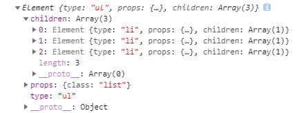
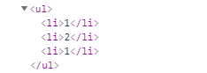
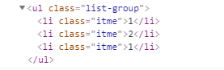
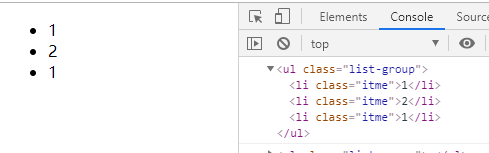
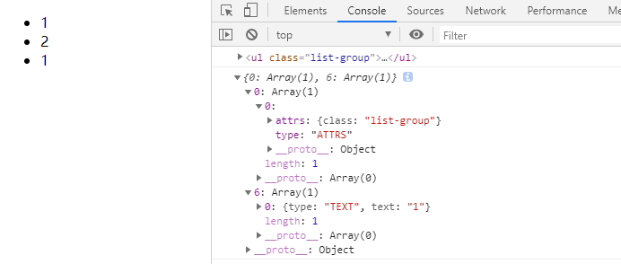

>高仿`React`的虚拟dom,外加冒牌的`diff`算法


## 前言
前端世界，框架横行。稍不留神，就会被技术淘汰，当然据小编所知，业界的巨头也只有其三。大家熟知的`Vue`由尤大神组队开发开源，可谓是国人的骄傲，`React`由Facebook团队维护，`Ng`大家都懂，国内市场份额较少，就不做多介绍。当然框架产出的原因，无非是利于管理，对于开发性能而言，其实是无多大用处的，借用尤大神的说法`只是在好管理项目的基础上提供还算不错的性能`。既然有这么大的框架，必须得有较为优秀的算法支撑，这次，咱们就研究研究，其高性能的背后支柱之一，虚拟Dom。

## 分析结构
通过虚拟Dom这个方法，产出一个Dom节点，首先分析一下HTML元素`<div class="container"><p class="text">text</p></div>`,由节点名称，节点属性，节点子孙组成，多层嵌套，无非就是加上`children`来递归实现。结构较为清晰，我给你一个对象，你返回一个Dom节点。
```javascript
let VertualDom = createElement("ul", { class: "list" }, [
    createElement("li", { class: "itme" }, ["1"]),
    createElement("li", { class: "itme" }, ["2"]),
    createElement("li", { class: "itme" }, ["2"]),
])
```
由一个一个对象构成，这样创建节点的函数明确了，当然仅仅这样是没有什么卵用的，我得改变页面，通过数据来驱动页面，这也是框架的精髓。先上来结构图分析一下。
```
── src
   ├── index   // 入口
   ├── element // 创建节点
   ├── patch   // 记录补丁包 
   └── diff    // 简单的算法修改补丁包
```
明确需求：通过`element`创建一个dom节点，修改数据调用`patch`来记录修改的数据,以此修改界面，但这样频繁的修改很耗性能，`diff`排上用场了，用最小的遍历角度优化修改补丁包，当然这是乞丐版的。源码可不止这样草率。

## index入口代码结构
```javascript
// index.js
import { createElement, render, renderDom } from './element'
let VertualDom = createElement("ul", { class: "list" }, [
    createElement("li", { class: "itme" }, ["1"]),
    createElement("li", { class: "itme" }, ["2"]),
    createElement("li", { class: "itme" }, ["2"]),
])

let el = render(VertualDom)
``` 
需求明确，需要`createElement`创建虚拟节点,`render`将创建的虚拟节点转换为真实`dom`元素,`renderDom`将转换后的真实`dom`挂载到`html`元素上

## element虚拟dom的前世今生
```javascript
// element.js
class Element { // 通过 Element 类方法批量创建
    constructor(type, props, children) {
        this.type = type
        this.props = props
        this.children = children
    }
}

//返回虚拟节点的object
function createElement(type, props, children) {
    return new Element(type, props, children)
}

```
此时的虚拟dom已经创建出来，不出所料会是一个`html`节点对象,回到`index.js`将其打印出来瞅瞅,



是他没错了，`type`代表类型,`prop`代表传入的各种属性,比如`class`，`id`啥的,`children`代表其子元素，或者文本元素,单光是这样是不够的，无法在浏览器中显示，这时候就需要`render`函数来转换节点了,回到`element.js`
```javascript
// element.js
//render将virtual node转化为真实dom
function render(eleObj) {
    let el = document.createElement(eleObj.type)
    //遍历children dom继续渲染 or 渲染文本
    eleObj.children.forEach(child => {
        child = (child instanceof Element) ? render(child) : document.createTextNode(child)
        el.appendChild(child)
    })
    return el;
}
```
解释一下,结构一目了然，创建传入的节点元素属性并创建出来，可能`children`存在多层，ok，遍历。当然`children`也可能不是`dom`节点，可能只是单纯的文字元素,这时候就需要做一点容错。当然创建节点不止如此，还要给节点添加传入的各种属性，这点稍后会说到。这时候，再回到`index.js`将其打印出来瞅瞅,看看dom节点长啥样



唉，有点样子了!但是总感觉少点什么，没错，得把属性加上去啊前端可就是靠样式吃饭的。那咱就写一个添加属性的方法上去，先明确需求，属性在普通标签`div`等等等可以直接添加上去比如`style`,`class`，但`input`，等文本标签的属性`value`等啊，就得另做处理。
```javascript
// element.js
function render(eleObj) {
    let el = document.createElement(eleObj.type)
    for (let key in eleObj.props) {
        //设置属性的方法
        setAttr(el, key, eleObj.props[key])
    }
    ...
}
//节点设置属性
function setAttr(node, key, value) {
    switch (key) {
        case "value": //node节点是input或者textarea
            if (node.tagName.toUpperCase() === "INPUT" || node.tagName.toUpperCase() === "TEXTAREA") {
                node.value = value
            } else {
                node.setAttribute(key, value)
            }
            break;
        case "style": //设置样式
            node.style.cssText = value
        default:
            node.setAttribute(key, value)
            break;
    }
}
```
分析功能，在创建完节点之后，咱们循环给节点添加属性，穿入当前元素`el`,当前第多少个要添加`key`，以及当前第多少个要添加的属性值`value`,掠一下，其实也不是很难,这里设置节点的时候，得用`switch`来穿透循环多个，可能有的节点同时拥有`style`,`class`等多个属性,最容易被忽略掉的就是输入框，他的属性值`value`容易被写掉，所以得专门抽出来，再来`index.js`看看打印结果



有点雏形了，接下来是最为重要的一步之一，将`dom`元素，挂载到`html`文档中，这个相对而言，就简单很多了直接上代码,看结果。当然你得在html文档中有一个可挂载的节点，并且`id`为`root`才行
```javascript
// element.js
//渲染页面
function renderDom(el, target) {
    target.appendChild(el)
}
//index.js
...
let el = render(VertualDom)
renderDom(el, window.root)
```



感觉离成功又近了一步，有没有，当然代码却不止如此，要不那多磕碜。

## element计算补丁包的神奇diff
代码到这，基本上算是离成功有近了一大步，起码元素渲染出来了，但是光渲染可不是我们想要的结果，咱们是要修改他的数据，然后数据映射到`dom`节点上，前文说到过，可不能忙不的修改，咱得考虑一下性能的问题，比如弄个补丁包记录一下修改值？听起来很不错，说干就干,分许需求，拥有一个能计算出前后修改差异的`diff`函数来算出差别。我传入一个修改之前的`VertualDom`,然后载传入修改之后的`VertualDom2`,自动给我返回一个补丁包对象。用法如下！
```javascript
//index.js
import { createElement, render, renderDom } from './element'
import diff from './diff'
let VertualDom = createElement("ul", { class: "list" }, [
    createElement("li", { class: "itme" }, ["1"]),
    createElement("li", { class: "itme" }, ["2"]),
    createElement("li", { class: "itme" }, ["2"]),
])

let VertualDom2 = createElement("ul", { class: "list-group" }, [
    createElement("li", { class: "itme" }, ["1"]),
    createElement("li", { class: "itme" }, ["2"]),
    createElement("li", { class: "itme" }, ["1"]),
])

let el = render(VertualDom)
renderDom(el, window.root)
let patchs = diff(VertualDom, VertualDom2)
```
看到用法，接下来根据需求来实现，老的节点与新的节点比较差异属性，首选递归，虽然容易出栈，但咱们就是试试，问题不大。其次，差异也分为其下几种展现形式
- 属性的差别
  - 新增属性
  - 删除属性
- 节点的差别
  - 新增节点
  - 删除节点
  - 替换节点
```javascript
//diff.js
function diff(oldTree, newTree) {
    let patches = {}
    let index = 0;
    //递归树，将比较的结果放入到补丁包中
    walk(oldTree, newTree, index, patches)
    return patches;
}
```
主函数来接收新旧节点，并且将索引值，补丁包对象传入来计算差异话,`walk`将递归dom结构来给修改的属性或节点存入补丁包
```javascript
//diff.js
//递归树
const ATTRS = Symbol.for("ATTRS")
const TEXT = Symbol.for("TEXT")
const REMOVE = Symbol.for("REMOVE")
const REPLACE = Symbol.for("REPLACE")
let INDEX = 0;
function walk(oldNode, newNode, index, patches) {
    let currentPatch = [];//每个元素都默认一个补丁对象
    if (!newNode) { //判断节点是否删除
        currentPatch.push({ type: REMOVE, index })
    } else if (isString(oldNode) && isString(newNode)) {//判断文本是否变化 判断 children 是否是文本
        if (oldNode !== newNode) {
            currentPatch.push({ type: TEXT, text: newNode })
        }
    } else if (oldNode.type === newNode.type) { //属性
        //比较属性是否更改 {1:a} => {1:a1}
        let attrs = diffAttr(oldNode.props, newNode.props)
        if (Object.keys(attrs).length > 0) {
            currentPatch.push({ type: ATTRS, attrs })
        }
        // if children 
        diffchildren(oldNode.children, newNode.children, patches)
    } else {
        //节点被替换掉
        currentPatch.push({ type: REPLACE, newNode })
    }
    if (currentPatch.length > 0) {
        //当前元素的确又补丁修改
        patches[index] = currentPatch
    }
}
```
分析一下代码：上面的常量就不用解释了，`Symbol`只是确保完全的唯一性，`INDEX`全局的索引，避免递归产生索引错乱,公用`isString`用来判断是否是文本节点对象，可以看出判断一步一步来，首先如果删除节点，想对象中接入键值对来表示该请求的属性是啥，比如`{ type: TEXT, text: newNode }`,`type`是补丁包修改的属性,可能是`TEXT`，可能是属性`ATTR`,或者其他的标识，有利于后面遍历。
```javascript
//判断children是否是字符串 --> 字符串无法使用forEach
function isString(node) {
    return Object.prototype.toString.call(node) === '[object String]';
}
```
比较属性的变化也是分为多种，新增删除或者修改，这里用了`diffAttr`来计算其差别，当然还有子节点比较`diffchildren`，当一切都是准别就绪是，一个计算补丁包的函数就搞定了，必需要确认的是最后一步`currentPatch.length > 0`至少补丁包得修改了才能返回吧，要不然，动不动我没修改就调用方法，岂不是很坑。下面来分析一下计算比较属性的方法
```javascript
//比较属性
function diffAttr(oldAttr, newAttr) {
    let patch = {};
    //判断新属性于老属性的关系
    for (let key in oldAttr) {
        if (oldAttr[key] !== newAttr[key]) {
            //比较老属性与新属性 不相同就存新属性
            patch[key] = newAttr[key] //有可能是undefined
        }
    }
    //判断是否是新增属性 老节点中没有新节点的属性
    for (let key in newAttr) {
        if (!oldAttr.hasOwnProperty(key)) {
            patch[key] = newAttr[key]
        }
    }
    return patch;
}
```
无非就是分为两种情况
- 老属性被删除
- 新属性增加
简单明了，有一点是可能会存在`undefined`这点小编暂时没有办法解决

再看一下分析子节点属性补丁包,使用递归简单明了
```javascript
function diffchildren(oldChildren, newChildren, patches) {
    //比较老的第一个 和新的第一个
    oldChildren.forEach((child, i) => {
        //索引还是第一次比较的索引 会有问题 index每次传递的给walk都会递增一次
        walk(child, newChildren[i], ++INDEX, patches)// 全局INDEX避免递归覆盖
    })
}
```
齐活，上代码看差别
```javascript
//index.js
let VertualDom = createElement("ul", { class: "list" }, [
    createElement("li", { class: "itme" }, ["1"]),
    createElement("li", { class: "itme" }, ["2"]),
    createElement("li", { class: "itme" }, ["2"]),
])

let VertualDom2 = createElement("ul", { class: "list-group" }, [
    createElement("li", { class: "itme" }, ["1"]),
    createElement("li", { class: "itme" }, ["2"]),
    createElement("li", { class: "itme" }, ["1"]),
])
let patchs = diff(VertualDom, VertualDom2)
//给元素打补丁 重新更新视图
console.log(patchs)
```



## element替换节点的工匠patch

有没有种自豪感，差别算出来了，接下来就是替换老节点了，将原有的`dom`置换掉，也是门技术活，说下思路，将打好标记的补丁包丢到函数内，遍历其中的区别属性，一次替换，性能不性能的先放一边，先以实现为主，期待用法
```javascript
//index.js
//给元素打补丁 重新更新视图
let el = render(VertualDom)// 老节点
let patchs = diff(VertualDom, VertualDom2) // 更改之后的补丁包
patch(el, patchs)
```
分析一下实现思路：遍历，循环，迭代,要不还是循环吧
```javascript
//patch.js
let allPatches;
let index = 0; //默认哪个需要打补丁

function patch(node, patches) {
    allPatches = patches
    walk(node)
}
```
主函数方法，全局存一个索引判断，避免出现污染状况
```javascript
//patch.js
//补丁包
function walk(node) {
    let currentPatch = allPatches[index++];
    let childNodes = node.childNodes;
    childNodes.forEach(child => walk(child))
    if (currentPatch) {
        doPatches(node, currentPatch)
    }
}
```
每一次循环都调用判断属性包的方法，并且得带其`children`
```javascript
//patch.js
//开始打补丁包
function doPatches(node, patches) {
    patches.forEach(patch => {
        switch (patch.type) {
            case "ATTRS":
                for (let key in patch.attrs) {
                    let value = patch.attrs[key]
                    if (value) {
                        setAttr(node, key, value)
                    } else {
                        node.removeAttribute(key)
                    }
                }
                break;
            case "TEXT":
                node.textContent = patch.text;
                break;
            case "REMOVE":
                node.parentNode.removeChild(node)
                break;
            case "REPLACE":
                let newNode = (patch.newNode instanceof Element) ?
                    render(patch.newNode) : document.createTextNode(patch.newNode)
                node.parentNode.replaceChild(newNode, node)
                break;
            default:
                break;
        }
    })
}
```
重点来了，将补丁包循环出来，这时候之前添加的`type`属性就派上用处了，`setAttr`也是之前的设置属性的方法，判断节点的时候需要过滤掉文本节点，文本与元素需要单独创建。至此，乞丐版的VirtualDom完工！也算是学习中的一点小笔记吧！


