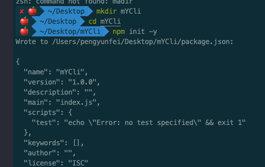
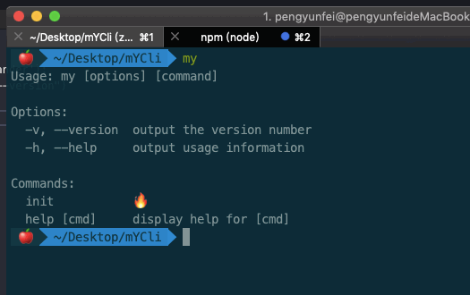
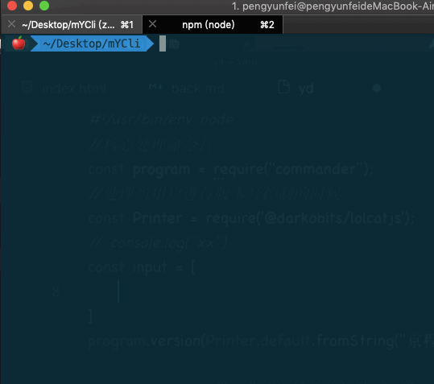
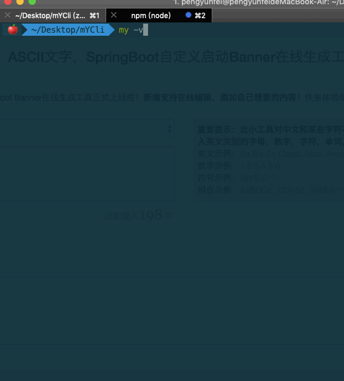
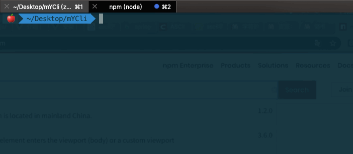
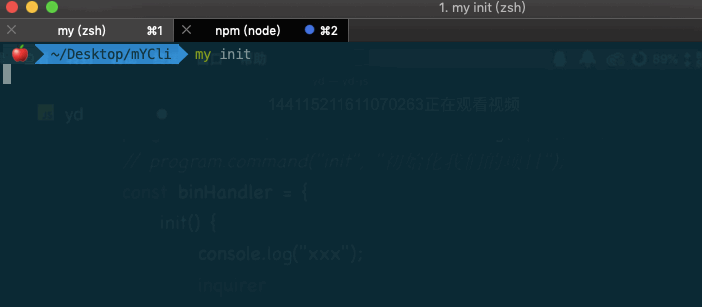
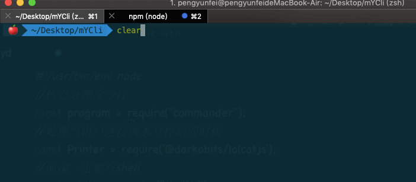

# 手搓一个属于自己的Vue-Cli

> 前端世界，框架横行。各种基于脚手架的工程化开发，大行其道。以前面试，不会框架算得上的耻辱。现如今，不会脚手架，也总感觉缺点啥。
较为成熟的脚手架比如Vue的 `Vue-Cli`, React的 `create-react-app`, ReactNative的 `react-native-cli` ，这些算的上是业界较为成熟的脚手架

## 前言
今天咱们就尝试手搓一个自己的乞丐版cli，算的上是一个小技巧吧。每次只知道用其他的脚手架，运行，然后就能跑项目，咱也不知道内部发生了啥。
前置知识，得懂一点 `Node`, `shell` 命令，不然也挺模糊的。

## 初始化
初始化一个项目结构先。接下来配置 `package.json` 配置文件。
```javascript
── myCli
   ├── bin// 存放配置文件    
   |    ├── my 
   |    └── package.json 
   └── package.json    // 初始化的配置文件

// package.json
{
  "main": "index.js",
  "bin": {
      "my": "./bin/my"
  },
  "scripts": {
    "test": "echo \"Error: no test specified\" && exit 1"
  },
  "keywords": [],
  "author": "",
  "license": "ISC"
}

// my
#!/usr/bin/env node

console.log('属于自己的脚手架')
```

## 基本配置文件

配置文件也是有讲究的，配置 `bin` 目录文件夹,自定义一条命令 `my` ，找到 `bin`目录下的文件 `my`, 当然这些都是指令已经文件名都是自己自定义的，绝对，绝对，绝对不能再配置文件中使用注释!
就绪之后，需要将自己的包 `link` 到全局环境中， 使用 `npm link` 会将命令发布到全局作用域，Mac 无法link的话 使用 `sudo`，一切就绪，回到命令行执行。



效果还是比较显著的，有没有一种自豪感，反正当时小编有一股慢慢的自豪感。当然如果你也想给其他人使用，在执行 `npm login` 上传到全局npm，然后别人执行 `npm install -g xxxx` ，就可以下载你设置的包来使用。
但是仅仅只是一条命令，总感觉缺点啥，得来点实用的。是干就干。回到自己的配置文件。
```javascript
// my
const program = require('commander'); 
program.version("6.6.6","-v, --version")
program.command("init","🔥")
program.parse(process.argv)
```
稍作解释，`commander` 属于沟通shell命令的包，`version` 版本信息，`command` 便是和用户交互的信息，`parse` 将命令push到进程中,这些都是固定的写法，不太理解的得去`npm`好好研究一下了。看效果。



## 美化项目界面

效果出来了，有点东西，但优秀的前端不止于此，有点嗑馋，上不了牌面，既然如此，咱给他美化美化呗。稍作改造。
```javascript
// 普通字
const Printer = require('@darkobits/lolcatjs')
program.version(Printer.default.fromString("打造最强cli"),"-v, --version")

//花里胡哨
const my = [
"              **   **" ,
" **********  //** ** " ,
"//**//**//**  //***  " ,
" /** /** /**   /**  "  , 
" /** /** /**   **    " ,
" *** /** /**  **   "   ,
"///  //  //  // "      ,
].join("\n");
program.version(Printer.default.fromString(my),"-v, --version")
```
`@darkobits/lolcatjs`负责将输出的终端命令变成渐变色，哎，光显示字，可不是咱的风格，要来就要来点骚操作。




## 终端交互反馈
脚手架只有这种花里胡哨的当然也不行，得和用户交互啊，接下来就是和用户交互，用户输入指定信息，这边作出反馈。回到配置文件。
```javascript
// 终端与用户对话
const chalk = require('chalk');
// 前端shell
const shelljs = require('shelljs');
const binParams = {
    init(){
        console.log('🍌')
    }
}
program
    .usage("[cmd] <options>")
    .arguments("<cmd> [env]")
    .action((cmd , otherParams)=> {
        const handler = binParams[cmd]
        if(typeof handler === "undefined"){
            console.log(`${chalk.yellow("️ ⚠️ 🚧 ")}sorry [${chalk.red(cmd)}] It's not defined 👽`);
            process.exit(1)
        }else{
            handler(otherParams)
        }
    })
```
`shelljs` 专注于与终端交互, `chalk` 接受用户的指令，并返回指令信息,`binParams` 存储所有的指令信息，对话时也要对参数进行校验，用户退出时 
得使用`process.exit(1)` 安全退出，没有相关指令，也可以向用户返回温馨提示信息。当然途中会存在一些⚠警告，后续也会处理掉。



基本的用户界面已经处理好了，但脚手架存在的目的就是下载项目架构，目的是下载，下载前得选择各种环境、状态、以及使用语言。捣鼓起来
```javascript
const inquirer = require('inquirer')
const binParams = {
    init(){
        inquirer
            .prompt([
                {
                    type: "text",
                    message: "请选择输入项目名称",
                    name:"dirname"
                },
                {
                    type: "list",
                    message: "请选择需要使用的语言",
                    choices: ["➤JavaScript", "➤TypeScript"],
                    name:"kind"
                }
            ])
            .then(answers => {
                // any wer
            })
    }
}
```
`inquirer`专门和用户对话的资源包，这结构看起来不陌生吧，每次构建项目时，这都是必选项，但目前也只是一次性操作，并不能完全选择。
这些其实没啥好纠结的，全是固定的包，固定的使用方法。先前看到的命令行有一条警告报错，其实只是警告命令，如果有强迫症可以将之前写的 `program.command("init","🔥");` 注释掉即可。然后配合上一些特殊字符会显得更加人性化。`then` 中也是用户输入后的所有反馈信息



选择模块既然得到了解决，下一步就是下载模块，下载之前，或者是下载中都得给用户提供下载体感，又到了装包的时刻。`ora` 一个简单的 `loading` 状态。
```javascript
const ora = require('ora')
 ...
then(answers => {
    const _dirname = answers.dirname;
    if(_dirname){
        const spinner = ora("🚀 最强cli玩命加载中...");
        spinner.start(); 
    }
})
```


看起来像那么回事，接下来就是下载模板的时候。

## 配置下载模板
终于到了能下载模板的时候。首先你得准别一套模板 `template`，其次得有一个下载工具 `download` 当然如果够格可以自己写一套，这里就随便找了一套代码
然后下载模板得有一个下载目的地路径，此处默认用第三方包`user-home` 找到用户的根目录，`shelljs`此时的作用至关重要，全靠它才能操作到用户的目录。
```javascript
const download = require('download');
const userHome = require('user-home');
const template = "direct:https://github.com/StackFei/Promises.git"
then(answers => {
    ...
    if(_dirname){
        ...
        ...
        const __project = `${userHome}/Desktop/${_dirname}`
        shelljs.cd(`${userHome}/Desktop/`);
        shelljs.rm('-rf',__project); 
        shelljs.mkdir(__dirname);
        download(template,__project,{clone:true}, err => {
            spinner.stop();
            //后续下载成功的操作
        })
    }
})
```

不出意外，一个崭新的属于自己的模板的cli就这么横空出世了。说简单不简单，说难不难。学会了也算是自己的一个小技巧吧。

